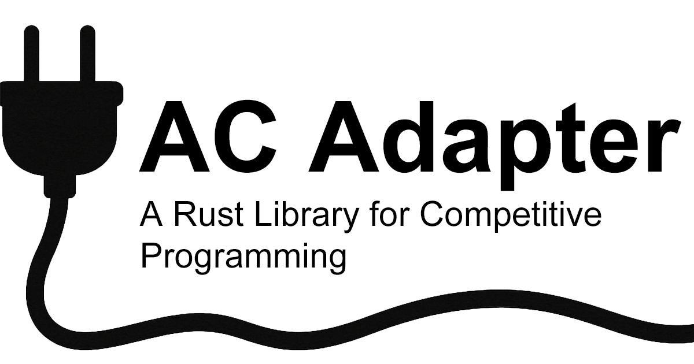

# AC Adapter



## API Document

https://ngtkana.github.io/ac-adapter-rs/

## Development

Install local pre-commit hooks:

```sh
cargo make hooks-install
```

Requires `cargo-make` and `cargo-nextest` (see `.github/actions/setup-rust/action.yml` for the versions CI uses). Runs `cargo fmt --check`, `clippy`, doctests, the full test suite, and doc generation before each commit — all confirmed lightweight (sub-second on an incrementally-built tree).


