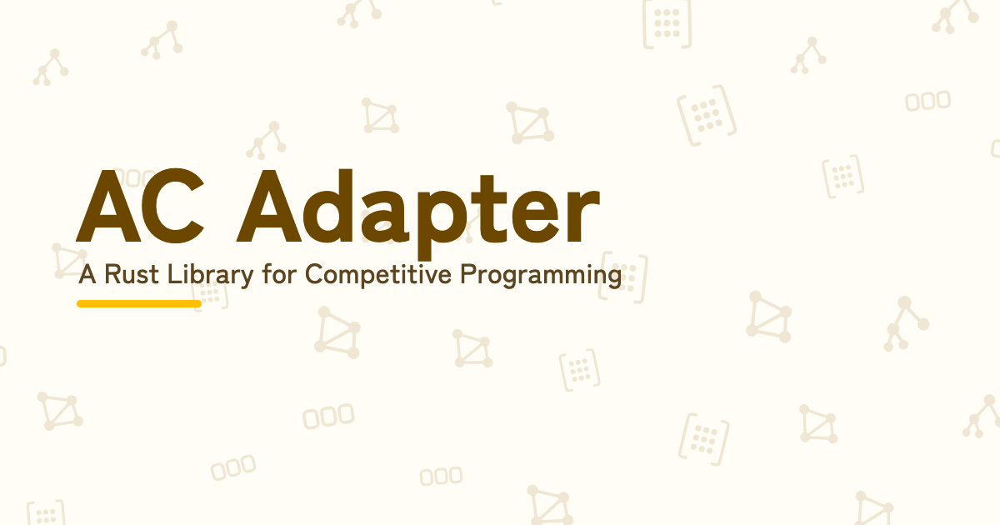

# AC Adapter



## API Document

https://ngtkana.github.io/ac-adapter-rs/

## Development

Install local pre-commit hooks:

```sh
cargo make hooks-install
```

Requires `cargo-make` and `cargo-nextest` (see `.github/actions/setup-rust/action.yml` for the versions CI uses). Runs `cargo fmt --check`, `clippy`, doctests, the full test suite, and doc generation before each commit — all confirmed lightweight (sub-second on an incrementally-built tree).

## 提出用バンドル

`acbundle` は指定したクレート（とその内部依存）を1つの AtCoder 提出用スニペットに展開します。

初回のみインストール:

```sh
cargo make install-acbundle
```

実行後、`$SHELL` から判定した rc ファイル名（zshなら `~/.zshrc`、bashなら `~/.bashrc`）と、実際のパス入りの `export AC_ADAPTER_RS_ROOT=...` 行が表示されるので、それをそのままコピーして追記してください。

追記後はどこからでも（例えば競プロ用の別リポジトリから）実行できます:

```sh
acbundle fp_fps dinic > bundled.rs   # 複数クレートを一度に、dedup付きで
```

既に別のファイルにバンドル済みのクレートがある場合（このツールが出力する `// <name> {{{` の fold マーカーで判別）、`--skip-from` で再展開を防げます:

```sh
acbundle fp_fps --skip-from src/main.rs > new_snippet.rs
```

クレート名のシェル補完（`bundler/completions/`）。自分のシェルに合う方だけを設定してください（`echo $SHELL` で確認できます）:

```sh
# zsh
mkdir -p ~/.zsh/completions
cp bundler/completions/_acbundle ~/.zsh/completions/
# ~/.zshrc に一度だけ追記: fpath=(~/.zsh/completions $fpath); autoload -Uz compinit && compinit

# bash（$AC_ADAPTER_RS_ROOT が先に export 済みである前提）
echo 'source "$AC_ADAPTER_RS_ROOT/bundler/completions/acbundle.bash"' >> ~/.bashrc
```

アンインストール:

```sh
cargo make uninstall-acbundle
```

シェル補完スクリプトをコピー・追記した場合は、`~/.zsh/completions/_acbundle` の削除と、rc ファイルに追記した `export AC_ADAPTER_RS_ROOT=...` / `source ...` 行も手動で削除してください。


